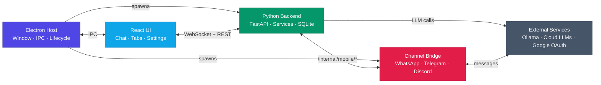
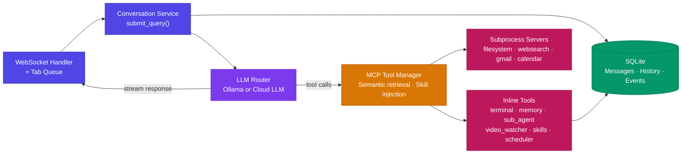

<div align="center">
  <a href="https://github.com/KashyapTan/xpdite">
    
  </a>
</div>

<h3 align="center">Xpdite - Your AI Assistant and Agent Harness</h3>

<p align="center">
  <a href="./LICENSE"></a>
  <a href="https://github.com/KashyapTan/xpdite/releases"></a>
  <a href="https://github.com/KashyapTan/xpdite/stargazers"></a>
</p>

<p align="center">
  <a href="./docs/getting-started.md"></a>
  <a href="./docs/README.md"></a>
  <a href="./docs/contributing.md"></a>
</p>

---

## Xpdite

An AI assistant and agent harness that is truly **yours**. It runs your desktop using any model provider, is completely open-source, 100% customizable, and built for everyone.
Use it as a desktop copilot, then continue the same experience from mobile channels through WhatsApp, Telegram, or Discord.

---

## Why Xpdite

- **Agent harness, not just chat** -- Supports multi-step execution with approval-aware actions and structured task flows.
- **Desktop-first workflow** -- Always-on-top app, screenshot-first interaction (`Alt + .`), and fast context switching.
- **Model flexibility** -- Use local Ollama models and/or cloud providers from a single interface.
- **Parallel context** -- Multi-tab chat with isolated session state and per-tab queueing.
- **Remote continuity** -- Mobile Channel Bridge keeps conversations accessible from messaging apps.
- **Extensible by design** -- Built for customization, integrations, and long-term evolution.

---

## Core Features

- **Comprehensive execution timeline UI** -- Beautiful in-chat thinking and tool-call rendering that shows model steps, live tool progress, terminal output, and completion states in a single readable flow.
- **Claude-style inline artifacts** -- Models can generate inline artifacts (code, markdown, and HTML) that are persisted, searchable, and easy to revisit from chat history.
- **`@` file attachments like a coding harness** -- Attach files instantly with `@<file_name>` from the input, then send mixed text + file context in one prompt.
- **Broad file intelligence** -- Reads and extracts content from code files, PDFs, Office documents, ODF/RTF formats, ZIP listings, and image files so context loading stays frictionless.
- **Advanced custom tool ecosystem** -- Includes high-capability web search, YouTube video watcher flows, an approval-aware terminal/bash runtime, and many more MCP/inline tools.
- **Mobile + desktop continuity** -- Start on desktop and continue from WhatsApp, Telegram, or Discord with paired session routing.

---

## Demo

Xpdite in action:


https://github.com/user-attachments/assets/412d2da8-ccba-4825-a47d-f1c6fca3d81f


https://github.com/user-attachments/assets/956f8147-c917-4aa2-bc60-771742cbdc9b

---

## Getting Started

### Connecting a provider

1. Choose how you want to run models:
   - **Local with Ollama (recommended)**: Download and install Ollama from [ollama.com/download](https://ollama.com/download).
   - **Cloud providers**: Bring your own API key (Anthropic, OpenAI, Gemini, or OpenRouter).
   - **ChatGPT subscription**: Connect your ChatGPT account through the bundled OpenAI Codex runtime using browser OAuth or device code; available models follow your account entitlements.
2. If you install Ollama, open Xpdite and go to **Settings -> Models** to pull models directly from the UI.
3. Browse available local models at [ollama.com/search](https://ollama.com/search).

### End users

1. Install the latest published build for your platform:
   Windows x64:
   ```bash
   irm https://kashyaptan.com/Xpdite/install.ps1 | iex
   ```
   macOS (Apple Silicon or Intel):
   ```bash
   curl -fsSL https://kashyaptan.com/Xpdite/install.sh | bash
   ```
   Manual downloads remain available on [Releases](https://github.com/KashyapTan/xpdite/releases) (recommended for windows).
2. Launch Xpdite and wait for startup checks to finish.
3. Press `Alt + .` to capture a screenshot and ask your question.

See [docs/getting-started.md](./docs/getting-started.md) for full setup details and optional channel pairing.

### Developers

Requirements: Bun, Python 3.13+, UV, Git. macOS audio builds also require Homebrew PortAudio.

```bash
git clone https://github.com/KashyapTan/xpdite.git
cd xpdite
bun install
bun run install:python
bun run dev
```

`install:python` selects the native dependency profile. Apple Silicon, Windows,
and Linux x64 use the full profile; Intel macOS uses the transcription profile.
Intel retains dictation, meeting transcription, and YouTube transcription while
WhisperX alignment, speaker diarization, and bundled Sentence Transformers are
unavailable. A configured Ollama embedding model and BM25 tool retrieval continue
to work on Intel.

Useful checks:

```bash
bun run lint
bun run test:frontend
uv run python -m pytest tests/ -v
bun run build
```

---

### Architecture Diagram

**System Overview** — the five major processes and how they connect:





**Backend Request Flow** — how a chat message moves through the Python process:





---

## Documentation

| Document | Description |
|----------|-------------|
| [Documentation Index](./docs/README.md) | Full docs map and recommended reading paths |
| [Getting Started](./docs/getting-started.md) | Installation, setup, and first run |
| [Architecture](./docs/architecture.md) | System design and data flow |
| [Development](./docs/development.md) | Developer guide, conventions, and common tasks |
| [API Reference](./docs/api-reference.md) | WebSocket and REST API docs |
| [MCP Guide](./docs/mcp-guide.md) | Tool integration guide |
| [Configuration](./docs/configuration.md) | All configurable settings |
| [Features Overview](./docs/features-overview.md) | Canonical map of all app features |
| [Artifacts](./docs/artifacts.md) | Artifact lifecycle, storage, and APIs |
| [Chat and Tabs](./docs/chat-and-tabs.md) | Core chat, tab isolation, and queue behavior |
| [Meeting Recorder](./docs/meeting-recorder.md) | Recording, transcript, and analysis flows |
| [Models and Providers](./docs/models-and-providers.md) | Local/cloud model handling and provider APIs |
| [Memory](./docs/memory.md) | Long-term memory model and APIs |
| [Skills](./docs/skills.md) | Builtin/user skills and slash-command injection |
| [Terminal](./docs/terminal.md) | Terminal approval model and real-time command flow |
| [Scheduled Jobs](./docs/scheduled-jobs.md) | Task automation lifecycle and APIs |
| [Notifications](./docs/notifications.md) | Notification events, storage, and APIs |
| [Mobile Bridge](./docs/mobile-bridge.md) | Remote messaging bridge architecture |
| [Operations Guide](./docs/operations.md) | Runtime operations, health checks, and recovery |
| [Security Overview](./docs/security.md) | Security controls and hardening guidance |
| [Troubleshooting](./docs/troubleshooting.md) | Common issues and fixes |
| [Contributing](./docs/contributing.md) | How to contribute |

---

## Contributing

Contributions are welcome. Read [docs/contributing.md](./docs/contributing.md) before opening a PR.

---

## License

[MIT](./LICENSE)

---

## Sponsor

<a href="https://github.com/sponsors/KashyapTan">
  
</a>
